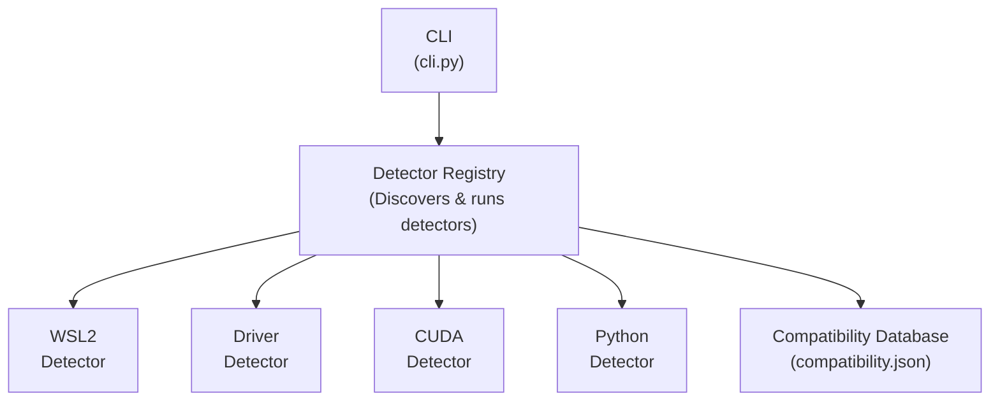

# Architecture

Understanding how Env-Doctor works internally.

## Overview



## Components

### The CLI (`cli.py`)

Entry point for all commands. Orchestrates detectors and presents unified diagnostics.

### The Detector Registry

Plugin system for detector discovery and execution. Allows easy addition of new detectors.

```python
from env_doctor.registry import DetectorRegistry

registry = DetectorRegistry()
results = registry.run_all()
```

### Detectors

Modular detection system with specialized detectors:

| Detector | Purpose |
|----------|---------|
| `WSL2Detector` | Environment detection, GPU forwarding validation |
| `NvidiaDriverDetector` | GPU driver version and capability detection |
| `CudaToolkitDetector` | System CUDA installation detection |
| `CudnnDetector` | cuDNN library detection and validation |
| `PythonLibraryDetector` | Python AI library version and CUDA compatibility |

Each detector returns a `DetectorResult` with:

- `status`: SUCCESS, WARNING, ERROR, NOT_FOUND
- `component`: What was detected
- `version`: Version string
- `path`: Installation path (if applicable)
- `metadata`: Additional detection details

### The Compatibility Database (`compatibility.json`)

Maps drivers to maximum supported CUDA versions and verified wheel URLs:

```json
{
  "cuda_driver_mapping": {
    "535.104.05": "12.2",
    "525.85.12": "12.0",
    "470.82.01": "11.4"
  },
  "pytorch_wheels": {
    "cu121": "https://download.pytorch.org/whl/cu121",
    "cu118": "https://download.pytorch.org/whl/cu118"
  }
}
```

### The Updater (`db.py`)

Fetches the latest compatibility rules from GitHub so you don't need to update the package frequently.

## Automated Database Updates

The compatibility database is maintained through automation:

### Scraper (`tools/scraper.py`)

- GitHub Actions runs periodically
- Scrapes official PyTorch/TensorFlow/JAX documentation
- Extracts CUDA compatibility mappings
- Creates pull requests with updates

### Validator (`tools/validator.py`) (Not Implemented yet)

- Validates scraped data structure
- Ensures version strings are parseable
- Catches malformed entries

### Human Review

- Automated updates create PRs (not auto-merged)
- Maintainers review before merging
- Community can flag issues

## Adding a New Detector

1. Create a detector class:

```python
from env_doctor.detectors.base import BaseDetector, DetectorResult, Status

class MyDetector(BaseDetector):
    name = "my_component"

    def detect(self) -> DetectorResult:
        # Detection logic here
        return DetectorResult(
            status=Status.SUCCESS,
            component=self.name,
            version="1.0.0",
            metadata={"key": "value"}
        )
```

2. Register in the registry (automatic via naming convention)

3. Add to CLI if needed

## See Also

- [Contributing Guide](https://github.com/mitulgarg/env-doctor/blob/main/CONTRIBUTING.md)
- [debug Command](commands/debug.md) - View raw detector output